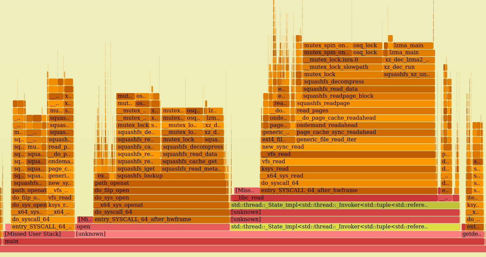

tracing Part II: subsection "BCC"
================================================================================
## BCC: BPF Compiler Collection intro

pro: 
- compilation on the fly with LLVM/Clang: same program can work on different kernels w/ different structs, needs kernel headers
- fast prototyping
- can use libraries for pre/postprocessing, e.g. sending events to a central log-server

contra:
- compilation on the fly with LLVM/Clang: dependent and slow/huge 
- development: errors at runtime

(Installation notes: best to compile from scratch for latest features BTF debugging support (e.g. source code interweaved in `bpftool prog dump xlated` output). BCC uses libbpf from your distribution or kernel or stand-alone mirror at https://github.com/libbpf/libbpf or libbpf from BCC repo, so you might easily end up with bcc tools which can't use all features.)

BCC is a frontend to BPF programm for python, C++ and Lua with many tools shipped with BCC in the `tools` directory or installed in /usr/share/bcc/tool. Compared to `bpftrace` scripts they offer more arguments/features because python is used to change the bpf program text before running it.

Focusing on python:
features:
 
 * python preprocessing
 * rewritting access to in-kernel memory e.g. to `struct task_struct` members via `bpf_probe_read()` (see below e.g.: `struct mm_struct *mm = curtask->mm;`)
 * compiling bpf program with LLVM/Clang
 * running and attaching to events
 * printing events, stacktraces, histograms


Take a look at the `opensnoop` tool shipped with BCC (https://github.com/iovisor/bcc/blob/master/tools/opensnoop.py) (https://github.com/iovisor/bcc/blob/master/tools/opensnoop_example.txt).

The actual bpf code is written in C syntax and stored as a string `bpf_text`. It get manipulated e.g. for filtering for User ID. A placeholder `UID_FILTER` is replaced with an `if` statement.

```python
 bpf_text = bpf_text.replace('UID_FILTER',
        'if (uid != %s) { return 0; }' % args.uid)
```

The string then gets passed to a python `BPF(text=bpf_text)` object and attached to a kprobe for older kernels <4.x.
```python
if not is_support_kfunc:
    b.attach_kprobe(event="do_sys_open", fn_name="trace_entry")
    b.attach_kretprobe(event="do_sys_open", fn_name="trace_return")
```

After that the event perf buffer is connected to a `print_event` callback to print the `open` events and polled forever or for `args.duration` seconds.


```python
b["events"].open_perf_buffer(print_event, page_cnt=64)
start_time = datetime.now()
while not args.duration or datetime.now() - start_time < args.duration:
    try:
        b.perf_buffer_poll() 
```

`b["events"]` acceses the bpf map `events`.

See the [BCC reference guide](#BCCreference) for documentation on all BCC python features.


Another similar but faster approach is using `libbpf`. You can use C programming features and other libraries for the userspace part and you don't have the LLVM/Clang overhead at runtime. A tracing application like `execsnoop` is split into two parts: userspace and bpf-program. The bpf-program defines ELF section names with macros like `SEC("tracepoint/syscalls/sys_enter_execve")` or `events SEC(".maps");` the `libbpf` loader library understands.

In the BCC github repository are `libbpf` tools written in C and compiled with LLVM10. These are tools converted from the python `BCC` tools directory: (https://github.com/iovisor/bcc/tree/master/libbpf-tools). See the [HOWTO: BCC to libbpf conversion](#bcc2libbpf). They accomplish the same tasks with less overhead at runtime. And also can use ["compile once run everywhere" features](#bpfcore), meaning libbpf does relocations.


Sample BCC _ELF-virus-scanner_ tool for checking if the contents of a ELF file/inode you are about the execute changed. Saving the inode because you currenly can't get full absolute path (july2020, new bpf helpers would be needed, or maybe "slow" dentry->d_parent walking).
It's tracing `sched_process_exec(filename)` and comparing the inode/file to a previous known good state in a .csv file. The file scanning part is in fs-scanner.cpp

Steps:
    - let fs-scanner scan your filesystem for all ELF files and make a hash on the elf-header (you might add the section header or other parts or the whole file too)
    - save the hashes with inodes and filenames to a csv file
    - run BCC-elf-virus-scanner.py to read the csv file and attach to tracepoint sched_process_exec
    - on tracepoint event lookup the inode in .csv and get the filename
    - calculate the hash on the filename
    - compare if the saved hash changed
    - output warning if !=

(note: PoC not the best way to do this: you should use fanotify or fs-verity (https://www.kernel.org/doc/html/latest/filesystems/fsverity.html) instead (https://git.kernel.org/pub/scm/linux/kernel/git/ebiggers/fsverity-utils.git))

```python

#!/usr/bin/python3
# curtask->mm->exe_file->f_inode->i_ino 

import csv
import os
import numpy as np
import warnings
warnings.filterwarnings(action='ignore',message='.*overflow*',category=RuntimeWarning)

from bcc import BPF

b = BPF(text="""
#include <uapi/linux/bpf.h>
#include <linux/dcache.h>
#include <linux/err.h>
#include <linux/fdtable.h>
#include <linux/fs.h>
#include <linux/fs_struct.h>
#include <linux/path.h>
#include <linux/sched.h>
#include <linux/slab.h>

#include <uapi/linux/ptrace.h>
#include <linux/sched.h>
#include <linux/fs.h>

struct data_t {
    u64 ts;
    u32 pid;
};

BPF_PERF_OUTPUT(events);

//int kprobe__do_nanosleep(void *ctx){
    
TRACEPOINT_PROBE(sched, sched_process_exec) { 
    struct data_t data = {};
    data.pid = bpf_get_current_pid_tgid();
    
    struct task_struct *curtask = (struct task_struct *) bpf_get_current_task();
    //inode= (*curtask->mm->exe_file->f_inode).i_ino;
    struct mm_struct *mm = curtask->mm;
    struct file *exe_file = mm->exe_file;
    struct inode *inode = exe_file->f_inode;
    
    data.ts = inode->i_ino;
    
    events.perf_submit(args, &data, sizeof(data));
    return 0;
};

""")
#u64 i = inode->i_ino;
#data.ts = bpf_ktime_get_ns() / 1000;

inode_dict = {}

with open('output', newline='') as csvfile:
    print('reading _*OLD*_ output file')
    csvreader = csv.DictReader(csvfile,delimiter=';')
    for row in csvreader:
        #rint(row['inode'], row['hash'])
        inode_dict[int(row['inode'])]=[row['hash'], row['file'] ]

def elf_hash(filename):
    print('in elf_hash for file: ' , filename)
    fd = os.open(filename, os.O_RDONLY)
    string1 = os.read(fd, 128)
    hash1=np.int32(5381)
    for i in range(4,128):
        tmp=np.int32()
        #print('i: ', i, ' tmp: ', tmp)
        tmp=np.left_shift(hash1, np.int32(5)) + hash1
        #print('i: ', i, ' tmp: ', tmp)
        hash1 = np.int32(tmp) + np.int8(string1[i])
        #print('i: ', i, ' hash: ', hash1)

    inthash1=int(hash1)
    return inthash1

def print_event(cpu, data, size):
    event = b["events"].event(data)
    print("%u %u" % (event.ts, event.pid))
    #print(type(event.ts))
    inode=event.ts
    hash_file=inode_dict.get(inode)
    if(hash_file != None):
        print('[hash, file] from output ', hash_file)
        new_hash = elf_hash(hash_file[1])
        intsavedhash = int(hash_file[0])
        print('newhash: ', new_hash, ' savedhash: ', intsavedhash)
        if(new_hash != intsavedhash):
            print('************** NOT EQUAL *****************')
        else:
            print('equal')

    else:
        print('does not exist in inode_dict: ', inode)

    print()
    

b["events"].open_perf_buffer(print_event)

while 1:
    try:
        b.perf_buffer_poll()
    except KeyboardInterrupt:
        exit()

```


From iovisor/BCC/tools and FlameGraph from B.Gregg:

profile.py which collects stack traces with a sampling frequency of 99 hertz and than nicely summarizes them as a FlameGraph:

```bash

# bcc/tools/profile.py -a -F99 60 -f > out-profile5.folded
# FlameGraph/flamegraph.pl --color=java   < out-profile5.folded > out-profile.folded5.svg

```
As clickable [.svg file]( or png picture:
 

## links
1. <a name="BCC"></a> BCC github repository   (https://github.com/iovisor/bcc)
1. <a name="BCCreference"></a> BCC reference guide (https://github.com/iovisor/bcc/blob/master/docs/reference_guide.md)
1. <a name="bcc2libbpf"></a> HOWTO: BCC to libbpf conversion    (https://facebookmicrosites.github.io/bpf/blog/2020/02/20/bcc-to-libbpf-howto-guide.html)
1. <a name="bpfcore"></a> BPF Portability and CO-RE    (https://facebookmicrosites.github.io/bpf/blog/2020/02/19/bpf-portability-and-co-re.html)
1. <a name="bgregg"></a> Brendan Gregg Homepage/Blog (www.brendangregg.com)
1. <a name=""></a> description      ()
1. <a name=""></a> description      ()
1. <a name=""></a> description      ()


